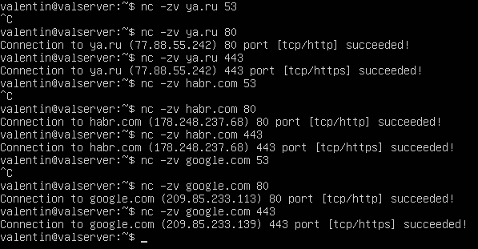

<h3>Задание №1</h3>

С помощью утилиты netplan повторить имеющиеся в системе параметры, но задать их статически. 

    

    <em>00-installer-config.yaml</em>

    

<h3>Задание №2</h3>

Запустить ping до сайта ya.ru , проверить доступность.

    

<h3>Задание №3</h3>

Hе останавливая ping, открыть отдельное окно терминала и вывести на экран только запросы в сторону (echo request) в сторону сайта ya.ru

    

<h3>Задание №4</h3>

С помощью утилиты nс проверить доступность основных портов (53,80, 443) y сайта ya.ru , habr.com , google.com. 

    

<h3>Задание №5</h3>

Проанализировать предложенный .рсар файл дампа сетевого трафика. 

    

    

