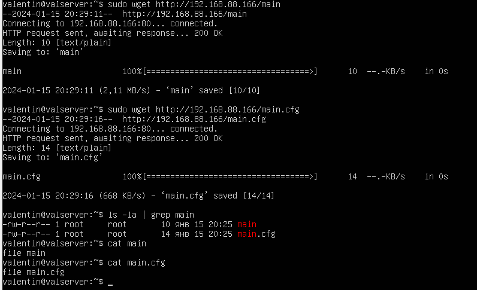

<h3>Задание №1</h3>

Установить и настроить TFTP-сервер, загрузить и скачать оттуда текстовый файл с содержимым на свое усмотрение.

1. Настройка файла конфигурации

    

    <em>tftpd-hpa</em>

2. Запуск службы

    

3. Создание файла на сервере

    

4. Получение файла с сервера

    

5. Создание файла и загрузка его на сервер

    

<h3>Задание №2</h3>

Установить и настроить NGINX. Сделать так, чтобы по запросу http://<ip адрес>/main можно было скачать файл/srv/www/main, а по запросу http://<ip адрес>/main.cfg- файл/srv/www/conf/main .cfg. Содержимое файлов может быть произвольным.

1. Настройка файла конфигурации

    

    <em>/etc/nginx/nginx.conf</em>

2. Создание директорий и файлов

    

3. Запуск службы

    

4. Получение файлов

    

